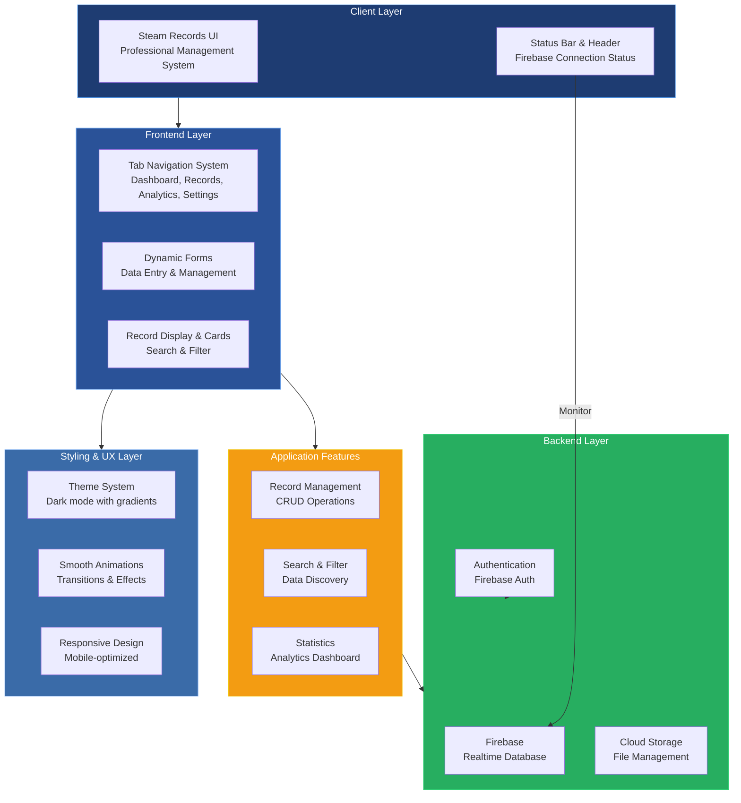

# Aki-App Architecture Overview

## System Architecture

## Component Breakdown

### Client Layer
- **Steam Records UI**: Main application interface with professional management system styling
- **Status Bar**: Real-time Firebase connection status indicator with color-coded states (connected, connecting, offline)

### Frontend Layer
- **Tab Navigation**: Multi-tab interface with dynamic switching (Dashboard, Records, Analytics, Settings)
- **Dynamic Forms**: Input forms for data entry with validation and helper text
- **Record Display**: Card-based layout with search functionality and filtering capabilities

### Styling & UX Layer
- **Theme System**: Dark mode with blue/accent color scheme and CSS variables
- **Animations**: Smooth transitions, wave effects, and interactive feedback
- **Responsive Design**: Mobile-optimized with proper viewport settings and touch support

### Backend Layer
- **Firebase Realtime Database**: Data persistence and synchronization
- **Firebase Authentication**: User authentication and access control
- **Cloud Storage**: File and media management

### Application Features
- **Record Management**: Create, Read, Update, Delete operations
- **Search & Filter**: Advanced data discovery mechanisms
- **Statistics**: Analytics dashboard and performance metrics

## Technology Stack

| Layer | Technology |
|-------|-----------|
| Frontend | HTML5, CSS3, JavaScript |
| Styling | CSS Grid, Flexbox, CSS Variables |
| Backend | Firebase Realtime Database |
| Authentication | Firebase Auth |
| Storage | Firebase Cloud Storage |
| Mobile | Responsive Design, PWA Capable |

## Key Design Features

### Visual Design
- **Color Palette**: Primary blue (#2a5298), accent colors for states
- **Typography**: System fonts with variable font weights
- **Spacing**: Consistent 4px/8px grid system
- **Shadows & Depth**: Multiple shadow levels for visual hierarchy

### Interactive Elements
- **Form Inputs**: Enhanced with focus states and validation feedback
- **Buttons**: Gradient backgrounds with ripple effects
- **Cards**: Hover effects and smooth transitions
- **Alerts**: Success/error states with animations

### Accessibility
- **Touch Optimization**: Larger tap targets for mobile
- **Color Contrast**: WCAG compliant color ratios
- **Semantic HTML**: Proper structure for screen readers
- **Meta Tags**: Viewport, theme color, and app capability settings

## Firebase Integration

The application maintains a real-time connection to Firebase with a status indicator showing:
- **Connected** (green): Active Firebase connection
- **Connecting** (yellow): Attempting connection
- **Offline** (red): Connection failed or lost

---

*Generated: 2026-07-17 | Aki-App v1.0*
